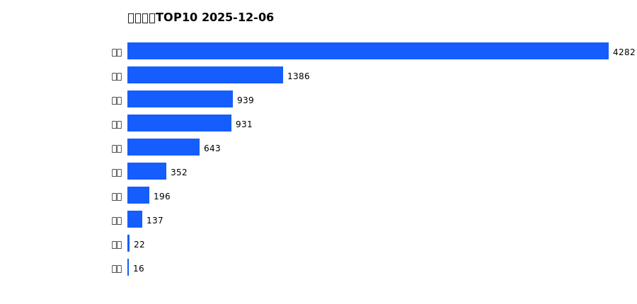
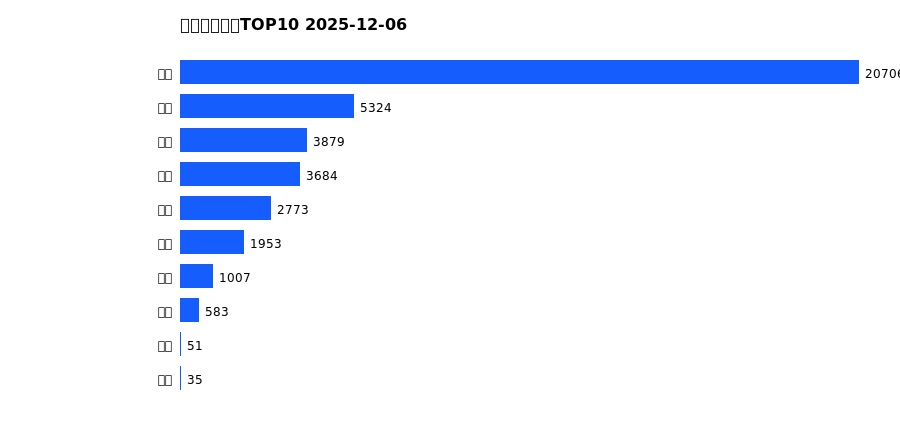
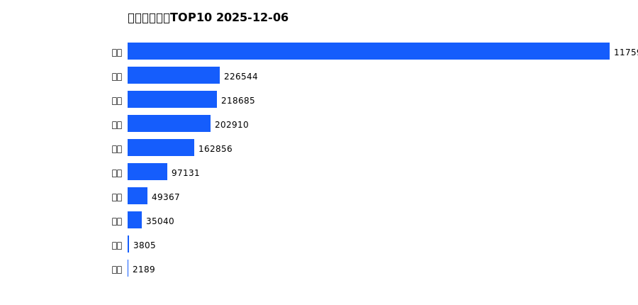
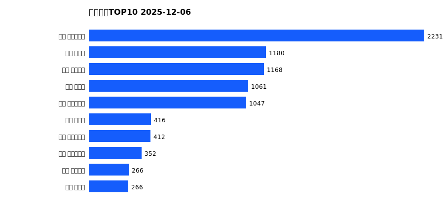
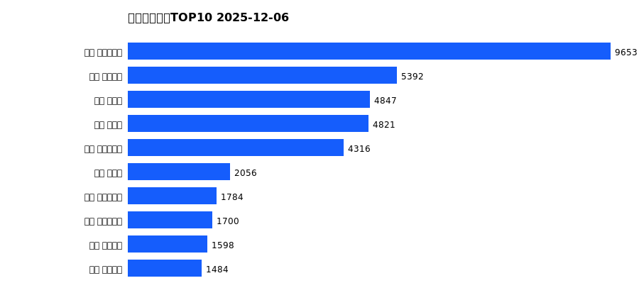

# 销售日报 2025-12-06

## 摘要

- 业态数: 10
- 门店数: 15
- 业态日销最大: 超市 4282
- 业态日销最小: 电玩 16
- 门店日销最大: 许昌 时代广场店 2231
- 门店日销最小: 许昌 劳动店 57
- 同比: -
- 环比: -

## 集团合计

| period | sales_wan |
| --- | --- |
| daily | 8903.0 |
| monthly | 39994.0 |
| yearly | 2174512.0 |

## 业态 TOP10

### 日销

| rank | business_type | sales_wan |
| --- | --- | --- |
| 1 | 超市 | 4281.73 |
| 2 | 服饰 | 1385.52 |
| 3 | 百货 | 938.56 |
| 4 | 珠宝 | 930.54 |
| 5 | 电器 | 643.31 |
| 6 | 茶叶 | 352.16 |
| 7 | 医药 | 195.99 |
| 8 | 餐饮 | 137.12 |
| 9 | 电影 | 22.22 |
| 10 | 电玩 | 15.92 |

### 月度累计

| rank | business_type | sales_wan |
| --- | --- | --- |
| 1 | 超市 | 20706.47 |
| 2 | 服饰 | 5323.89 |
| 3 | 珠宝 | 3879.34 |
| 4 | 百货 | 3683.51 |
| 5 | 电器 | 2772.93 |
| 6 | 茶叶 | 1953.3 |
| 7 | 医药 | 1006.64 |
| 8 | 餐饮 | 582.8 |
| 9 | 电影 | 50.96 |
| 10 | 电玩 | 34.53 |

### 年度累计

| rank | business_type | sales_wan |
| --- | --- | --- |
| 1 | 超市 | 1175985.38 |
| 2 | 珠宝 | 226543.65 |
| 3 | 百货 | 218684.77 |
| 4 | 电器 | 202909.54 |
| 5 | 服饰 | 162856.38 |
| 6 | 茶叶 | 97130.82 |
| 7 | 医药 | 49366.76 |
| 8 | 餐饮 | 35040.18 |
| 9 | 电玩 | 3805.12 |
| 10 | 电影 | 2189.09 |

## 门店 TOP10

### 日销

| rank | store_name | sales_wan |
| --- | --- | --- |
| 1 | 许昌 时代广场店 | 2231.04 |
| 2 | 新乡 小胖店 | 1179.53 |
| 3 | 许昌 天使城店 | 1167.52 |
| 4 | 新乡 大胖店 | 1061.32 |
| 5 | 许昌 生活广场店 | 1046.78 |
| 6 | 许昌 禹州店 | 415.98 |
| 7 | 许昌 大众服饰店 | 412.17 |
| 8 | 许昌 实业公司店 | 351.72 |
| 9 | 许昌 金三角店 | 266.12 |
| 10 | 许昌 北海店 | 265.53 |

### 月度累计

| rank | store_name | sales_wan |
| --- | --- | --- |
| 1 | 许昌 时代广场店 | 9652.72 |
| 2 | 许昌 天使城店 | 5392.18 |
| 3 | 新乡 大胖店 | 4846.62 |
| 4 | 新乡 小胖店 | 4820.66 |
| 5 | 许昌 生活广场店 | 4316.1 |
| 6 | 许昌 禹州店 | 2056.41 |
| 7 | 许昌 实业公司店 | 1783.97 |
| 8 | 许昌 大众服饰店 | 1700.32 |
| 9 | 许昌 线上商城 | 1597.65 |
| 10 | 许昌 金三角店 | 1484.37 |

### 年度累计

| rank | store_name | sales_wan |
| --- | --- | --- |
| 1 | 许昌 时代广场店 | 555761.29 |
| 2 | 许昌 天使城店 | 306790.97 |
| 3 | 新乡 大胖店 | 306649.04 |
| 4 | 新乡 小胖店 | 249419.92 |
| 5 | 许昌 生活广场店 | 162278.8 |
| 6 | 许昌 实业公司店 | 119516.53 |
| 7 | 许昌 禹州店 | 110455.34 |
| 8 | 许昌 线上商城 | 90018.48 |
| 9 | 许昌 北海店 | 85650.99 |
| 10 | 许昌 金三角店 | 84167.77 |

