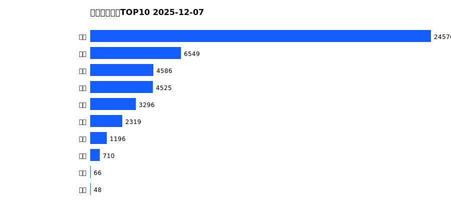
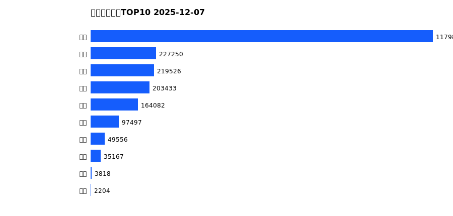
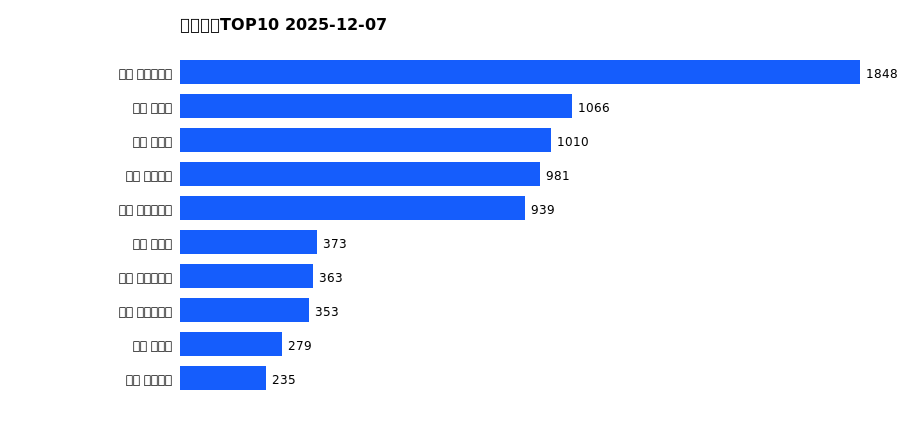
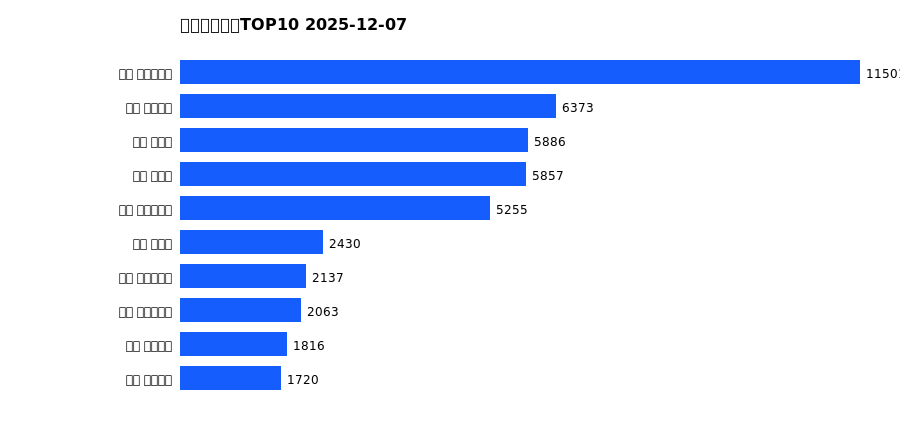
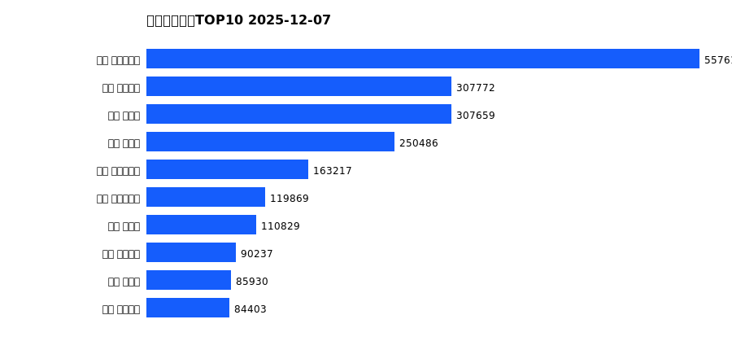

# 销售日报 2025-12-07

## 摘要

- 业态数: 10
- 门店数: 15
- 业态日销最大: 超市 3870
- 业态日销最小: 电玩 13
- 门店日销最大: 许昌 时代广场店 1848
- 门店日销最小: 许昌 劳动店 43
- 同比: -
- 环比: -

## 集团合计

| period | sales_wan |
| --- | --- |
| daily | 7877.0 |
| monthly | 47871.0 |
| yearly | 2182389.0 |

## 业态 TOP10

### 日销

| rank | business_type | sales_wan |
| --- | --- | --- |
| 1 | 超市 | 3869.61 |
| 2 | 服饰 | 1225.37 |
| 3 | 百货 | 841.59 |
| 4 | 珠宝 | 706.54 |
| 5 | 电器 | 523.49 |
| 6 | 茶叶 | 365.79 |
| 7 | 医药 | 189.28 |
| 8 | 餐饮 | 126.77 |
| 9 | 电影 | 15.32 |
| 10 | 电玩 | 13.23 |

### 月度累计

| rank | business_type | sales_wan |
| --- | --- | --- |
| 1 | 超市 | 24576.08 |
| 2 | 服饰 | 6549.26 |
| 3 | 珠宝 | 4585.89 |
| 4 | 百货 | 4525.1 |
| 5 | 电器 | 3296.42 |
| 6 | 茶叶 | 2319.09 |
| 7 | 医药 | 1195.91 |
| 8 | 餐饮 | 709.57 |
| 9 | 电影 | 66.28 |
| 10 | 电玩 | 47.76 |

### 年度累计

| rank | business_type | sales_wan |
| --- | --- | --- |
| 1 | 超市 | 1179854.99 |
| 2 | 珠宝 | 227250.19 |
| 3 | 百货 | 219526.36 |
| 4 | 电器 | 203433.03 |
| 5 | 服饰 | 164081.75 |
| 6 | 茶叶 | 97496.61 |
| 7 | 医药 | 49556.04 |
| 8 | 餐饮 | 35166.94 |
| 9 | 电玩 | 3818.35 |
| 10 | 电影 | 2204.42 |

## 门店 TOP10

### 日销

| rank | store_name | sales_wan |
| --- | --- | --- |
| 1 | 许昌 时代广场店 | 1848.21 |
| 2 | 新乡 小胖店 | 1065.79 |
| 3 | 新乡 大胖店 | 1010.11 |
| 4 | 许昌 天使城店 | 980.8 |
| 5 | 许昌 生活广场店 | 938.52 |
| 6 | 许昌 禹州店 | 373.39 |
| 7 | 许昌 大众服饰店 | 362.75 |
| 8 | 许昌 实业公司店 | 352.73 |
| 9 | 许昌 北海店 | 278.61 |
| 10 | 许昌 金三角店 | 235.2 |

### 月度累计

| rank | store_name | sales_wan |
| --- | --- | --- |
| 1 | 许昌 时代广场店 | 11500.93 |
| 2 | 许昌 天使城店 | 6372.98 |
| 3 | 新乡 小胖店 | 5886.46 |
| 4 | 新乡 大胖店 | 5856.73 |
| 5 | 许昌 生活广场店 | 5254.62 |
| 6 | 许昌 禹州店 | 2429.8 |
| 7 | 许昌 实业公司店 | 2136.7 |
| 8 | 许昌 大众服饰店 | 2063.07 |
| 9 | 许昌 线上商城 | 1816.43 |
| 10 | 许昌 金三角店 | 1719.56 |

### 年度累计

| rank | store_name | sales_wan |
| --- | --- | --- |
| 1 | 许昌 时代广场店 | 557609.51 |
| 2 | 许昌 天使城店 | 307771.77 |
| 3 | 新乡 大胖店 | 307659.15 |
| 4 | 新乡 小胖店 | 250485.72 |
| 5 | 许昌 生活广场店 | 163217.32 |
| 6 | 许昌 实业公司店 | 119869.26 |
| 7 | 许昌 禹州店 | 110828.73 |
| 8 | 许昌 线上商城 | 90237.26 |
| 9 | 许昌 北海店 | 85929.6 |
| 10 | 许昌 金三角店 | 84402.97 |

