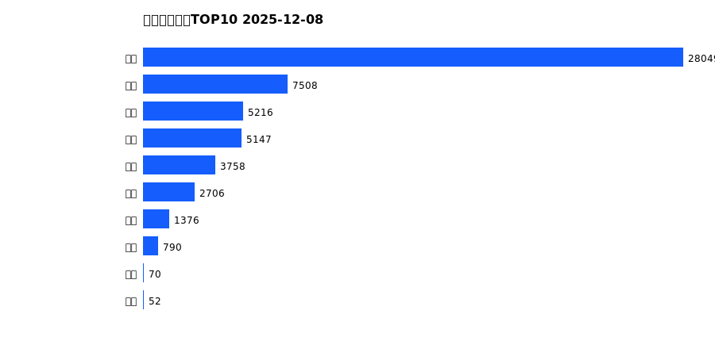
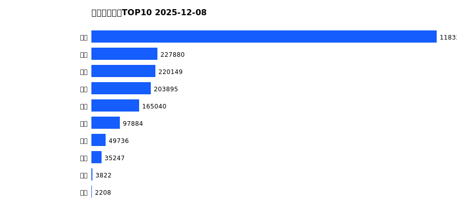
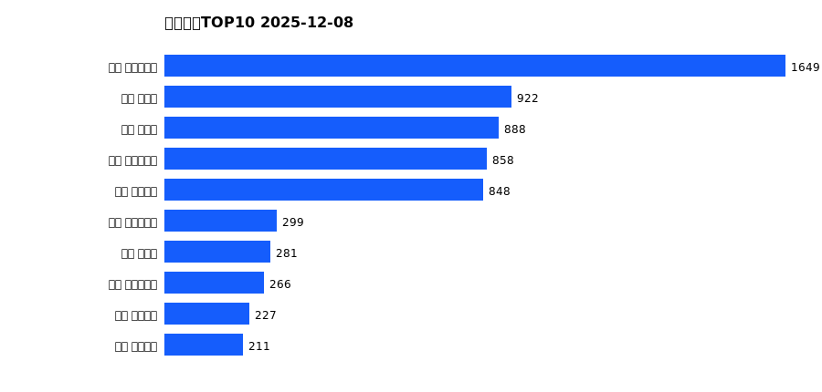
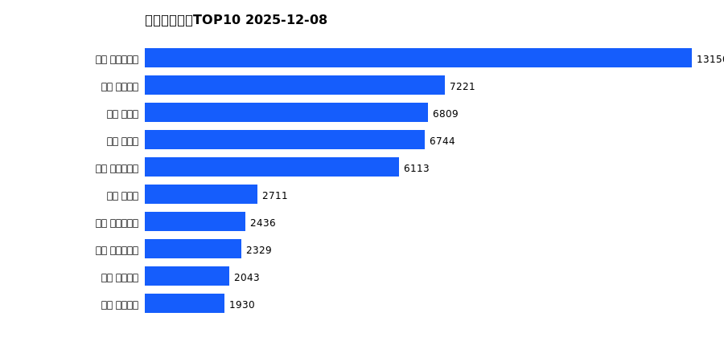
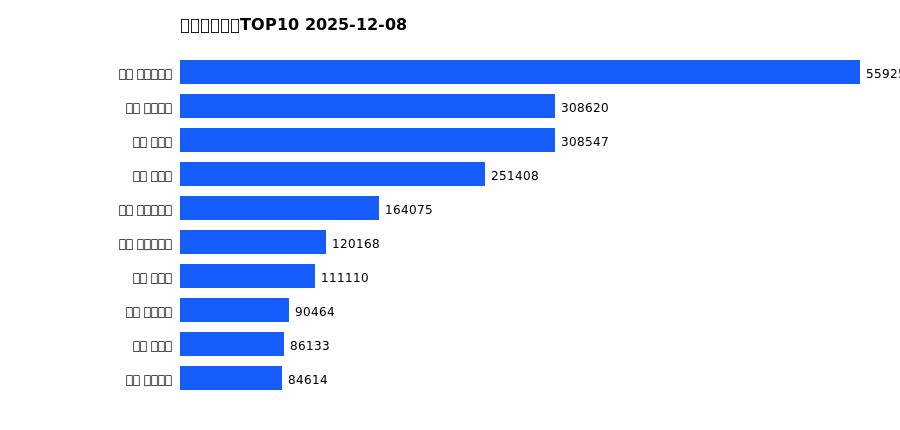

# 销售日报 2025-12-08

## 摘要

- 业态数: 10
- 门店数: 15
- 业态日销最大: 超市 3473
- 业态日销最小: 电影 3
- 门店日销最大: 许昌 时代广场店 1649
- 门店日销最小: 许昌 劳动店 42
- 同比: -
- 环比: -

## 集团合计

| period | sales_wan |
| --- | --- |
| daily | 6800.0 |
| monthly | 54671.0 |
| yearly | 2189188.0 |

## 业态 TOP10

### 日销

| rank | business_type | sales_wan |
| --- | --- | --- |
| 1 | 超市 | 3472.91 |
| 2 | 服饰 | 958.3 |
| 3 | 珠宝 | 629.91 |
| 4 | 百货 | 622.17 |
| 5 | 电器 | 461.82 |
| 6 | 茶叶 | 386.99 |
| 7 | 医药 | 180.27 |
| 8 | 餐饮 | 80.04 |
| 9 | 电玩 | 3.92 |
| 10 | 电影 | 3.29 |

### 月度累计

| rank | business_type | sales_wan |
| --- | --- | --- |
| 1 | 超市 | 28048.99 |
| 2 | 服饰 | 7507.56 |
| 3 | 珠宝 | 5215.8 |
| 4 | 百货 | 5147.36 |
| 5 | 电器 | 3758.24 |
| 6 | 茶叶 | 2706.07 |
| 7 | 医药 | 1376.18 |
| 8 | 餐饮 | 789.61 |
| 9 | 电影 | 69.57 |
| 10 | 电玩 | 51.68 |

### 年度累计

| rank | business_type | sales_wan |
| --- | --- | --- |
| 1 | 超市 | 1183327.91 |
| 2 | 珠宝 | 227880.11 |
| 3 | 百货 | 220148.62 |
| 4 | 电器 | 203894.85 |
| 5 | 服饰 | 165040.05 |
| 6 | 茶叶 | 97883.6 |
| 7 | 医药 | 49736.3 |
| 8 | 餐饮 | 35246.98 |
| 9 | 电玩 | 3822.26 |
| 10 | 电影 | 2207.71 |

## 门店 TOP10

### 日销

| rank | store_name | sales_wan |
| --- | --- | --- |
| 1 | 许昌 时代广场店 | 1649.07 |
| 2 | 新乡 小胖店 | 922.14 |
| 3 | 新乡 大胖店 | 887.66 |
| 4 | 许昌 生活广场店 | 858.12 |
| 5 | 许昌 天使城店 | 848.31 |
| 6 | 许昌 实业公司店 | 299.24 |
| 7 | 许昌 禹州店 | 281.49 |
| 8 | 许昌 大众服饰店 | 266.28 |
| 9 | 许昌 线上商城 | 226.7 |
| 10 | 许昌 金三角店 | 210.93 |

### 月度累计

| rank | store_name | sales_wan |
| --- | --- | --- |
| 1 | 许昌 时代广场店 | 13150.0 |
| 2 | 许昌 天使城店 | 7221.38 |
| 3 | 新乡 小胖店 | 6808.6 |
| 4 | 新乡 大胖店 | 6744.39 |
| 5 | 许昌 生活广场店 | 6112.75 |
| 6 | 许昌 禹州店 | 2711.29 |
| 7 | 许昌 实业公司店 | 2435.93 |
| 8 | 许昌 大众服饰店 | 2329.35 |
| 9 | 许昌 线上商城 | 2043.13 |
| 10 | 许昌 金三角店 | 1930.5 |

### 年度累计

| rank | store_name | sales_wan |
| --- | --- | --- |
| 1 | 许昌 时代广场店 | 559258.58 |
| 2 | 许昌 天使城店 | 308620.17 |
| 3 | 新乡 大胖店 | 308546.81 |
| 4 | 新乡 小胖店 | 251407.86 |
| 5 | 许昌 生活广场店 | 164075.45 |
| 6 | 许昌 实业公司店 | 120168.49 |
| 7 | 许昌 禹州店 | 111110.22 |
| 8 | 许昌 线上商城 | 90463.96 |
| 9 | 许昌 北海店 | 86132.66 |
| 10 | 许昌 金三角店 | 84613.9 |

