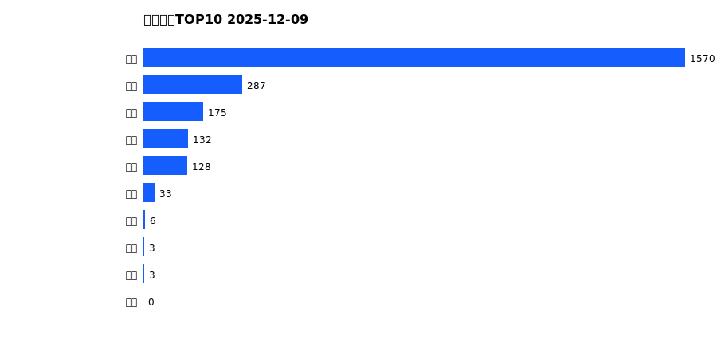
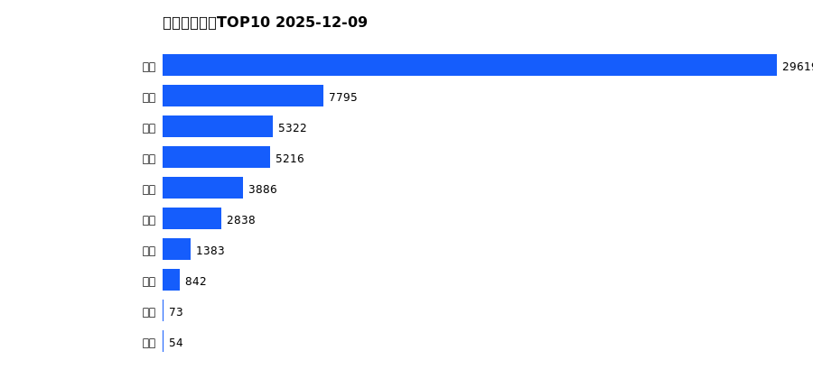
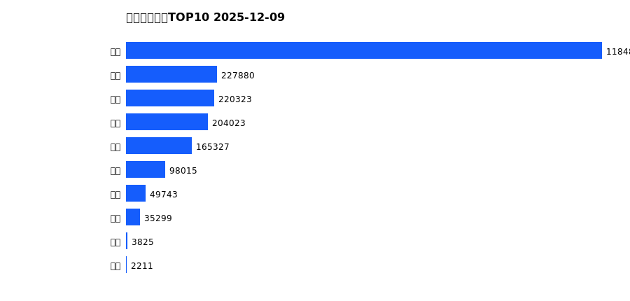
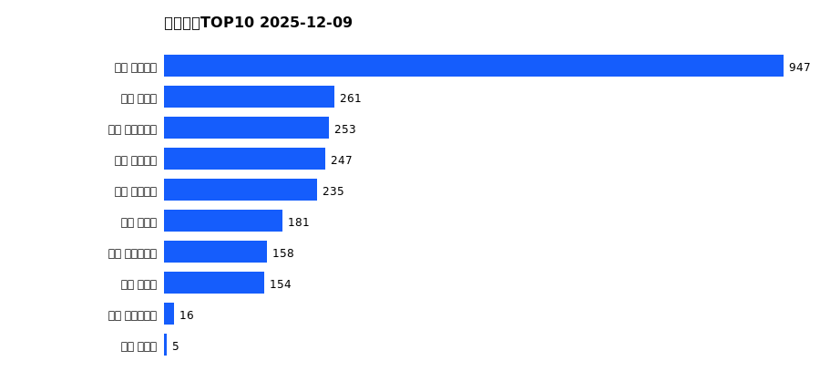
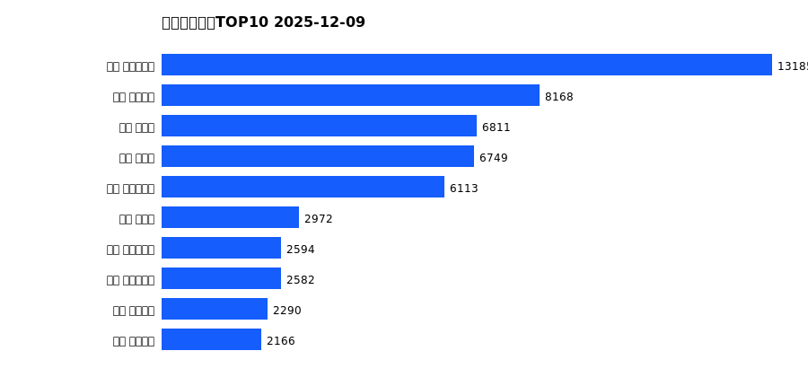
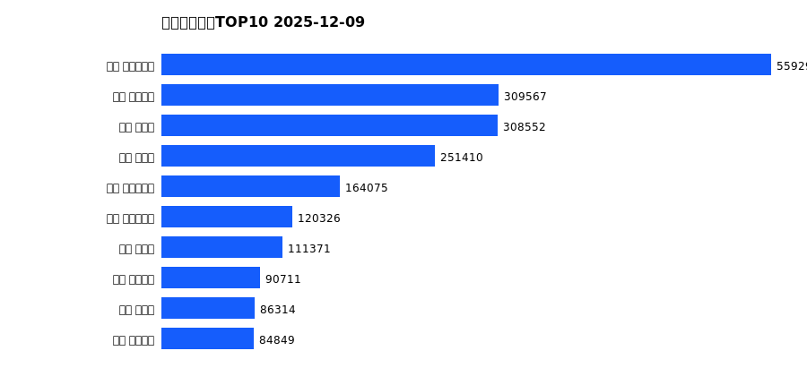

# 销售日报 2025-12-09

## 摘要

- 业态数: 10
- 门店数: 15
- 业态日销最大: 超市 1570
- 业态日销最小: 珠宝 0
- 门店日销最大: 许昌 天使城店 947
- 门店日销最小: 许昌 生活广场店 0
- 同比: -
- 环比: -

## 集团合计

| period | sales_wan |
| --- | --- |
| daily | 2335.0 |
| monthly | 57026.0 |
| yearly | 2191543.0 |

## 业态 TOP10

### 日销

| rank | business_type | sales_wan |
| --- | --- | --- |
| 1 | 超市 | 1569.79 |
| 2 | 服饰 | 286.96 |
| 3 | 百货 | 174.63 |
| 4 | 茶叶 | 131.54 |
| 5 | 电器 | 127.71 |
| 6 | 餐饮 | 32.53 |
| 7 | 医药 | 6.49 |
| 8 | 电影 | 3.03 |
| 9 | 电玩 | 2.8 |
| 10 | 珠宝 | 0.0 |

### 月度累计

| rank | business_type | sales_wan |
| --- | --- | --- |
| 1 | 超市 | 29618.78 |
| 2 | 服饰 | 7794.53 |
| 3 | 百货 | 5321.99 |
| 4 | 珠宝 | 5215.8 |
| 5 | 电器 | 3885.94 |
| 6 | 茶叶 | 2837.61 |
| 7 | 医药 | 1382.67 |
| 8 | 餐饮 | 841.55 |
| 9 | 电影 | 72.6 |
| 10 | 电玩 | 54.48 |

### 年度累计

| rank | business_type | sales_wan |
| --- | --- | --- |
| 1 | 超市 | 1184897.7 |
| 2 | 珠宝 | 227880.11 |
| 3 | 百货 | 220323.25 |
| 4 | 电器 | 204022.55 |
| 5 | 服饰 | 165327.02 |
| 6 | 茶叶 | 98015.13 |
| 7 | 医药 | 49742.8 |
| 8 | 餐饮 | 35298.92 |
| 9 | 电玩 | 3825.06 |
| 10 | 电影 | 2210.74 |

## 门店 TOP10

### 日销

| rank | store_name | sales_wan |
| --- | --- | --- |
| 1 | 许昌 天使城店 | 946.56 |
| 2 | 许昌 禹州店 | 260.71 |
| 3 | 许昌 大众服饰店 | 252.51 |
| 4 | 许昌 线上商城 | 246.65 |
| 5 | 许昌 金三角店 | 235.07 |
| 6 | 许昌 北海店 | 181.17 |
| 7 | 许昌 实业公司店 | 157.66 |
| 8 | 许昌 金汇店 | 154.01 |
| 9 | 许昌 时代广场店 | 15.63 |
| 10 | 新乡 大胖店 | 4.81 |

### 月度累计

| rank | store_name | sales_wan |
| --- | --- | --- |
| 1 | 许昌 时代广场店 | 13185.03 |
| 2 | 许昌 天使城店 | 8167.94 |
| 3 | 新乡 小胖店 | 6811.17 |
| 4 | 新乡 大胖店 | 6749.2 |
| 5 | 许昌 生活广场店 | 6112.75 |
| 6 | 许昌 禹州店 | 2972.0 |
| 7 | 许昌 实业公司店 | 2593.59 |
| 8 | 许昌 大众服饰店 | 2581.86 |
| 9 | 许昌 线上商城 | 2289.79 |
| 10 | 许昌 金三角店 | 2165.57 |

### 年度累计

| rank | store_name | sales_wan |
| --- | --- | --- |
| 1 | 许昌 时代广场店 | 559293.61 |
| 2 | 许昌 天使城店 | 309566.73 |
| 3 | 新乡 大胖店 | 308551.62 |
| 4 | 新乡 小胖店 | 251410.43 |
| 5 | 许昌 生活广场店 | 164075.45 |
| 6 | 许昌 实业公司店 | 120326.15 |
| 7 | 许昌 禹州店 | 111370.93 |
| 8 | 许昌 线上商城 | 90710.62 |
| 9 | 许昌 北海店 | 86313.83 |
| 10 | 许昌 金三角店 | 84848.97 |

