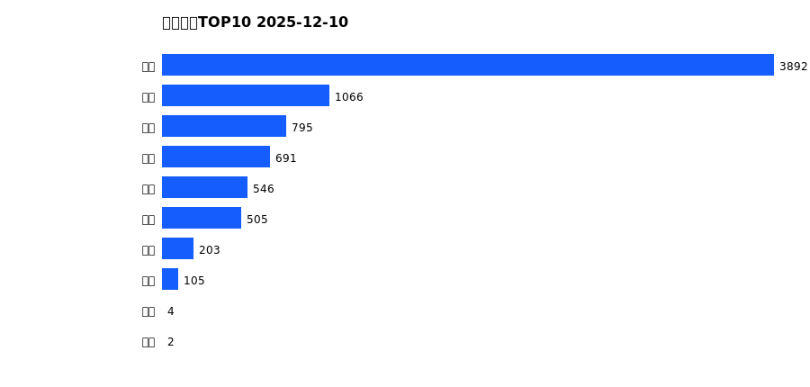
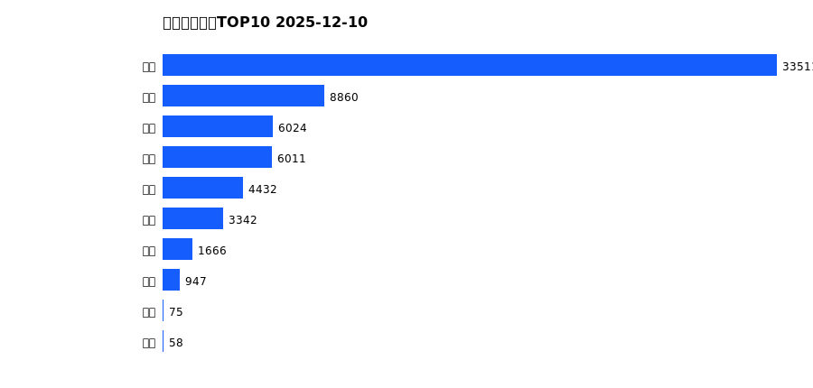
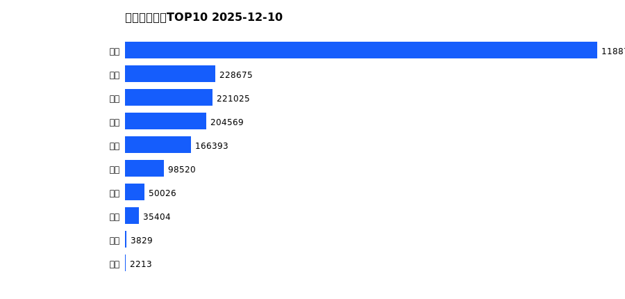
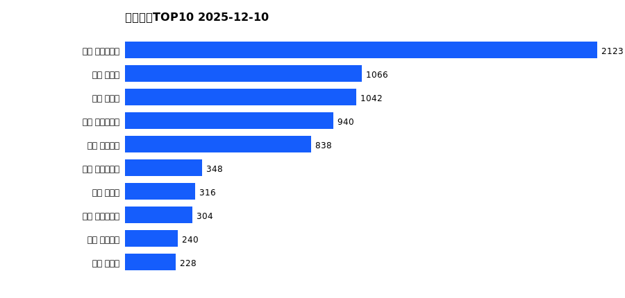
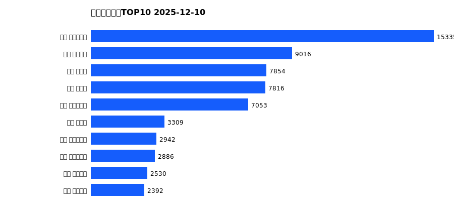
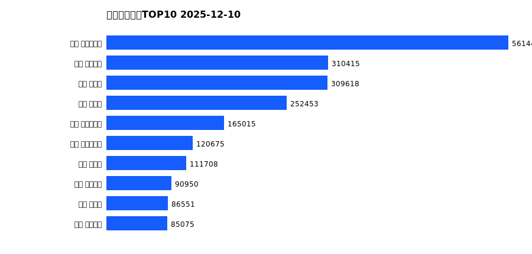

# 销售日报 2025-12-10

## 摘要

- 业态数: 10
- 门店数: 15
- 业态日销最大: 超市 3892
- 业态日销最小: 电影 2
- 门店日销最大: 许昌 时代广场店 2123
- 门店日销最小: 许昌 劳动店 43
- 同比: -
- 环比: -

## 集团合计

| period | sales_wan |
| --- | --- |
| daily | 7810.0 |
| monthly | 64927.0 |
| yearly | 2199444.0 |

## 业态 TOP10

### 日销

| rank | business_type | sales_wan |
| --- | --- | --- |
| 1 | 超市 | 3892.29 |
| 2 | 服饰 | 1065.69 |
| 3 | 珠宝 | 795.03 |
| 4 | 百货 | 690.91 |
| 5 | 电器 | 546.48 |
| 6 | 茶叶 | 504.67 |
| 7 | 医药 | 202.83 |
| 8 | 餐饮 | 105.27 |
| 9 | 电玩 | 3.95 |
| 10 | 电影 | 2.48 |

### 月度累计

| rank | business_type | sales_wan |
| --- | --- | --- |
| 1 | 超市 | 33511.07 |
| 2 | 服饰 | 8860.21 |
| 3 | 百货 | 6023.89 |
| 4 | 珠宝 | 6010.82 |
| 5 | 电器 | 4432.42 |
| 6 | 茶叶 | 3342.28 |
| 7 | 医药 | 1665.75 |
| 8 | 餐饮 | 946.81 |
| 9 | 电影 | 75.09 |
| 10 | 电玩 | 58.43 |

### 年度累计

| rank | business_type | sales_wan |
| --- | --- | --- |
| 1 | 超市 | 1188789.99 |
| 2 | 珠宝 | 228675.13 |
| 3 | 百货 | 221025.15 |
| 4 | 电器 | 204569.03 |
| 5 | 服饰 | 166392.7 |
| 6 | 茶叶 | 98519.8 |
| 7 | 医药 | 50025.87 |
| 8 | 餐饮 | 35404.19 |
| 9 | 电玩 | 3829.01 |
| 10 | 电影 | 2213.22 |

## 门店 TOP10

### 日销

| rank | store_name | sales_wan |
| --- | --- | --- |
| 1 | 许昌 时代广场店 | 2123.37 |
| 2 | 新乡 大胖店 | 1066.38 |
| 3 | 新乡 小胖店 | 1042.41 |
| 4 | 许昌 生活广场店 | 939.89 |
| 5 | 许昌 天使城店 | 838.31 |
| 6 | 许昌 实业公司店 | 348.4 |
| 7 | 许昌 禹州店 | 315.59 |
| 8 | 许昌 大众服饰店 | 304.44 |
| 9 | 许昌 线上商城 | 239.71 |
| 10 | 许昌 北海店 | 228.2 |

### 月度累计

| rank | store_name | sales_wan |
| --- | --- | --- |
| 1 | 许昌 时代广场店 | 15335.18 |
| 2 | 许昌 天使城店 | 9016.4 |
| 3 | 新乡 小胖店 | 7853.57 |
| 4 | 新乡 大胖店 | 7815.58 |
| 5 | 许昌 生活广场店 | 7052.63 |
| 6 | 许昌 禹州店 | 3308.99 |
| 7 | 许昌 实业公司店 | 2941.99 |
| 8 | 许昌 大众服饰店 | 2886.3 |
| 9 | 许昌 线上商城 | 2529.5 |
| 10 | 许昌 金三角店 | 2391.5 |

### 年度累计

| rank | store_name | sales_wan |
| --- | --- | --- |
| 1 | 许昌 时代广场店 | 561443.76 |
| 2 | 许昌 天使城店 | 310415.19 |
| 3 | 新乡 大胖店 | 309618.0 |
| 4 | 新乡 小胖店 | 252452.83 |
| 5 | 许昌 生活广场店 | 165015.34 |
| 6 | 许昌 实业公司店 | 120674.55 |
| 7 | 许昌 禹州店 | 111707.92 |
| 8 | 许昌 线上商城 | 90950.33 |
| 9 | 许昌 北海店 | 86550.59 |
| 10 | 许昌 金三角店 | 85074.9 |

